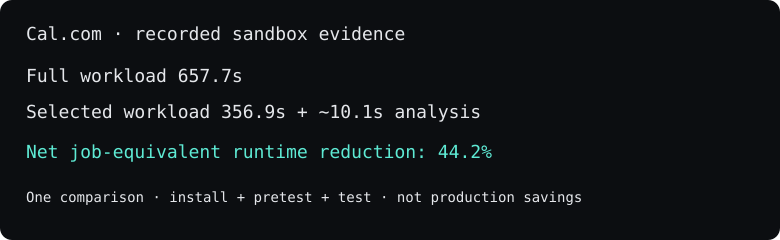

# DiffCI

**Open-source test-impact analysis for faster CI.** DiffCI finds tests affected by a code change and measures full versus selected runtime for teams evaluating CI savings.

```bash
npx "@diffci.com/diffci@latest" check
```

Requires Git and Node.js 22.5+. Runs tests locally and sends nothing by default; keep required CI authoritative.

**Measured example:** a controlled Cal.com sandbox replay measured **44.2% net reduction** in an install + pretest + test workload, including analysis overhead. This is one job-equivalent comparison, not production savings or a forecast.
[Timings and limitations](docs/research/2026-08-24-calcom-execution-observability/11-frozen-identity-and-complete-job-savings.md).



[Star the open-source engine](https://github.com/DiffCI/core) · [Volunteer a pilot repository](https://diffci.com/#pilot).
Watch → Custom → Releases and Discussions on Core to follow support and benchmark updates.

The engine lives in **[DiffCI/core](https://github.com/DiffCI/core)**. This repository contains the CLI, integrations, website, and product surfaces.

[Website](https://diffci.com/) · [Test impact analysis guide](https://diffci.com/test-impact-analysis/github-actions) · [Open evidence study](https://diffci.com/research/diffci-open-evidence-2026)


[](https://www.npmjs.com/package/@diffci.com/diffci)
[](https://docs.npmjs.com/generating-provenance-statements)
[](https://diffci.com/mcp-server)
[](docs/ai-agents.md)
[](https://github.com/marketplace/actions/diffci-observer)

**The verification layer between AI-generated code and shipping.** DiffCI snapshots an agent's staged,
unstaged, and non-ignored untracked changes, determines the minimum executable test verification, and
runs it. Uncertainty broadens to full verification; a failed, incomplete, or changed snapshot blocks.
The `check` command remains the paired-runtime evaluation surface. `observe` and the Marketplace Action
remain observation-only; DiffCI also generates a separate blocking verification workflow.

## Try DiffCI

From a Git repository checkout, with Node.js 22.5+ and Git installed, run:

```bash
npx "@diffci.com/diffci@latest" verify --changed --json
```

`verify --changed` covers staged, unstaged, and non-ignored untracked content. It runs the selected
command when DiffCI can prove one, otherwise the inferred full test command. Exit zero means that exact
content-addressed snapshot passed and remained unchanged while tests ran. The JSON receipt includes
`verification`, `safe_to_continue`, selection counts, the command result, and tree identities.

For paired full-versus-selected runtime measurement, use `check`. For analysis without test execution,
use `npx "@diffci.com/diffci@latest" observe --no-send`.

To prepare a maintainer-reviewable pilot without changing the target repository or running its tests:

```bash
npx "@diffci.com/diffci@latest" pilot-packet --repo /path/to/checkout \
  --label owner/repository --repository-url https://github.com/owner/repository
```

The command writes `pilot-packet.md`, the raw observation, and a pinned non-blocking GitHub Actions
workflow to `../diffci-output` by default. The packet describes compatibility and planned selection;
it does not present planned reduction as measured runtime savings.

To add instructions for coding agents, run:

```bash
npx "@diffci.com/diffci@latest" init
```

To also pin DiffCI as a development dependency and update the detected npm, pnpm, Yarn, or Bun
lockfile, pass `--install`. Add `--workflow` for a non-blocking observation job and
`--verification-workflow` for a blocking commit-range gate:

```bash
npx "@diffci.com/diffci@latest" init --install --workflow --verification-workflow
```

`--install` also adds `diffci:verify`, `diffci:check`, and `diffci:observe` package scripts. It preserves same-named
scripts that the project already owns. After installation, CI or contributors can run
`npm run diffci:verify`, `npm run diffci:check`, or `npm run diffci:observe` without knowing the package name or version.
Generated agent rules use the detected package manager's local script when DiffCI is installed.

In CI, `diffci verify --json` resolves the pull-request or push range automatically. It requires a
clean checkout, refuses when the analyzed head differs from executed `HEAD`, and binds the receipt to
both the resolved range and checkout tree. Use `--base` and `--head` for an explicit range.

On Windows PowerShell, quote the package name:

```powershell
npx "@diffci.com/diffci@latest" verify --changed --json
```

The [copyable adoption kit](docs/agent-adoption-kit.md) includes an `AGENTS.md` instruction and
maintainer PR text. AI-readable documentation is on [Context7 CLI](https://context7.com/diffci/diffci.com)
and [Context7 Core](https://context7.com/diffci/core). Use the [GitHub Marketplace Action](https://github.com/marketplace/actions/diffci-observer)
for a separate, non-blocking observation job. Required project CI remains authoritative.

One paired run is preliminary evidence. `verify-savings` can repeat comparisons, alternate arm order,
record declared cache state, and run an explicit cache-preparation command before every arm. A result is
labelled controlled only after at least three alternating, cache-prepared repetitions. On a
full-validation fallback, `check` runs the full command once and reports 0% reduction.

**Upgrade from 0.1.3:** tests excluded by a source-only `tsconfig.json` could be discovered without
their dependency edges, producing an incomplete selection. This is fixed in **0.1.4**. Revalidate
affected observations before using them as opportunity evidence; see the
[historical validation](docs/evidence/growth-history-01/README.md) and
[release qualification](docs/evidence/release-0.1.4/README.md).

The local default compares `HEAD` with its first parent; both commits must be available. For a specific
comparison, add `--base <base-sha> --head <head-sha>`. DiffCI prints the selection, fallback reasons,
and the path to a JSON report outside your checkout. `REFUSED` or `ERROR` is not a successful analysis;
check the reported status even when the command exits successfully. See the
[support matrix](docs/language-support.md) for setup requirements and supported workloads.
`check` runs inferred full and selected commands in the checkout and sends nothing by default.
The commands may write generated files. Use `observe --no-send` for analysis without execution.
See [`docs/ai-agents.md`](docs/ai-agents.md) for Claude Code, Codex,
Cursor, GitHub Copilot, and similar tools.

**Measured example:** a controlled Cal.com replay showed **44.2% net reduction in a job-equivalent
install + pretest + test workload**, including analysis overhead. This is one sandbox comparison,
not Cal.com's production savings or a prediction for your repository.
[Read the timings and method](docs/research/2026-08-24-calcom-execution-observability/11-frozen-identity-and-complete-job-savings.md).

Selection counts alone do not establish runtime savings. `check` reports a measured percentage only
when both commands pass and the checked-out commit and worktree remain identical across both arms.
The savings artifact embeds the base/head SHAs, observation SHA-256, commands, timings, and checkout
snapshots. Snapshots use byte-level fingerprints for dirty files, manifests, lockfiles, and available
resolved-dependency markers; the report also records the runner identity. A mismatch invalidates the
comparison. `observe` does not execute tests.

For an advanced paired runtime check, you can still run `observe` first and then run `verify-savings`
against the observation report. It compares your normal full command with
DiffCI's proposed selected command and writes JSON plus Markdown evidence; see
[`docs/npm-adoption.md`](docs/npm-adoption.md#self-serve-runtime-pilot).

For stronger evidence, run repeated measurements with an explicit cache preparation command:

```bash
npx "@diffci.com/diffci@latest" verify-savings \
  --repo . --full "npm test" --selected-from-report ../diffci-observation.json \
  --out ../diffci-savings.json --repetitions 3 --cache-state warm \
  --cache-prepare "node scripts/prepare-ci-cache.mjs"
```

DiffCI alternates full/selected order, reports min/median/max timings, and conservatively classifies
stable selection misses, likely flakes, shared/pre-existing failures, infrastructure failures, and
inconclusive results. Cache preparation is user-supplied because DiffCI must not delete repository or
tool caches on its own.

## Validate same-turn change specifications

When an agent or build tool supplies explicit specification IDs and logical targets, DiffCI can block
two specifications from silently changing the same target:

```json
{
  "specifications": [
    { "id": "SPEC-API", "logicalTarget": "com.example.Widget#run" },
    { "id": "SPEC-BEHAVIOR", "logicalTarget": "com.example.Widget#run" }
  ]
}
```

```bash
npx "@diffci.com/diffci@latest" validate-specs --file change-specifications.json
```

The command exits non-zero and names every conflicting specification ID. This surface is opt-in and
does not infer semantic targets from source code; callers must provide stable logical target names.

## Block in GitHub Actions

Generate a dedicated verification check with:

```bash
npx "@diffci.com/diffci@latest" init --verification-workflow
```

The generated `.github/workflows/diffci-verify.yml` checks out the exact pull-request head with full
history, runs `diffci verify --json`, and uploads the commit-bound receipt even when verification
fails. It has no `continue-on-error`: configure its **DiffCI verification** job as a required check
after a successful pilot. A zero exit means the selected verification (or conservative full fallback)
passed for the exact analyzed commit and checkout tree.

## Observe in GitHub Actions

Save this as `.github/workflows/diffci.yml` to add a dedicated, non-blocking observation job:

```yaml
name: DiffCI observation
on: [push, pull_request]
permissions:
  contents: read
jobs:
  diffci:
    runs-on: ubuntu-24.04
    continue-on-error: true
    steps:
      - uses: actions/checkout@3d3c42e5aac5ba805825da76410c181273ba90b1 # immutable checkout pin
        with:
          fetch-depth: 0
      - uses: DiffCI/DiffCI.com@cc870c9258adf8a278d7fe678f0d793ff65cdae6
```

Then check the workflow locally with `npx "@diffci.com/diffci@latest" verify-workflow`. Keep the observer
out of required checks and other jobs' `needs` lists. The Action adds a job summary and a
`diffci-observation` artifact to the run; it does not alter which tests your other jobs execute.
The example pins release `v0.3.4` to its qualified feature commit SHA for reproducibility.

The CLI sends no report with `--no-send`. The Action uploads a GitHub artifact by default; sending to
DiffCI's hosted service requires an explicitly configured endpoint and token.
[Installation details](docs/distribution.md) · [Seven-day pilot](docs/shadow-pilot-runbook.md)

## Use DiffCI

| Surface | Use it for | Current distribution |
| --- | --- | --- |
| [`@diffci.com/diffci`](https://www.npmjs.com/package/@diffci.com/diffci) | Try `observe` locally, run an opt-in runtime pilot, or install the GitHub Action from this repository | Published npm CLI and Action |

The CLI bundles a pinned revision of the [Core engine](https://github.com/DiffCI/core) from GitHub. Users install only
`@diffci.com/diffci`; the `check` command above uses it directly. Core performs Git analysis,
dependency graphs, impact, path baseline, and selected-command planning. The report format and
non-interfering GitHub Action remain in this repository. See
[`docs/package-relationship.md`](docs/package-relationship.md) for the source relationship.
For evaluation results and their limits, start with
[`docs/adoption-evidence.md`](docs/adoption-evidence.md).

## Agent Adoption

Add DiffCI instructions to a repository:

```bash
npx "@diffci.com/diffci@latest" init
```

Then ask your coding agent to run:

```bash
npx "@diffci.com/diffci@latest" verify --changed --json
```

Agent-specific docs:
[`Codex`](docs/codex.md) ·
[`Claude Code`](docs/claude-code.md) ·
[`Cursor`](docs/cursor.md) ·
[`GitHub Copilot`](docs/copilot.md) ·
[`Grok`](docs/grok.md).

Live discovery files:
[`llms.txt`](https://diffci.com/llms.txt) ·
[`AI agents`](https://diffci.com/docs/ai-agents).

Adoption materials:
[`outreach copy`](docs/adoption-outreach.md) ·
[`metrics`](docs/adoption-metrics.md) ·
[`targets`](docs/agent-adoption-targets.md).

For native agent integrations, DiffCI provides a stateless, read-only HTTPS MCP endpoint for validation
guidance:

```text
https://diffci.com/mcp
```

Use the stdio MCP server when tools need to inspect the local checkout or run tests:

```bash
npx -p "@diffci.com/diffci@latest" diffci-mcp
```

See the [MCP server page](https://diffci.com/mcp-server) for Codex, Claude Code, Cursor, and VS Code setup, or [`docs/mcp.md`](docs/mcp.md) for repository documentation.

## Project background

## Public Core and private Cloud

DiffCI's public-good analysis engine is released separately from its commercial hosted product.
The project lives in the [DiffCI GitHub organization](https://github.com/DiffCI).
This repository was transferred to `DiffCI/DiffCI.com` on 2026-09-16.

| Component | Scope | Licensing |
| --- | --- | --- |
| [DiffCI Core](https://github.com/DiffCI/core) | Standalone dependency/change analysis, CI graph inference, safety/fallback, advisory test selection, synthetic benchmarking and local compute measurement | AGPL-3.0-only; public |
| DiffCI Cloud | Hosted infrastructure, billing, enterprise dashboard, organization management, proprietary data/services, and managed acceleration | Proprietary |
| Optional enterprise code | Separately scoped, visible and auditable enterprise capabilities | Source available, with commercial production rights controlled by DiffCI |

**This mixed repository is public.** The reviewed Core extraction was published separately, with
fresh Git history. This repository retains its existing engine snapshot while package integration is
migrated separately. No blanket AGPL license applies to this repository. Public Core is advisory-only;
energy/carbon/cost are modeled estimates, not verified environmental savings. The exact extraction is
recorded in [the Core release audit](docs/core-release-audit.md).

The funded Core should run independently of DiffCI Cloud. AGPL permits commercial use and competing
hosting; it adds source-sharing obligations for covered modifications, including qualifying remote
network use. Grant eligibility depends on each grant's agreement and funded deliverables.

See the [licensing boundaries](docs/licensing.md), [organization and migration plan](docs/github-organization.md),
and [prepared organization profile](docs/github-org/profile/README.md).


**This repository moved out of the [DentalPresence.in](https://github.com/adityankale190895/DentalPresence.in)
monorepo** (previously `diffci/` there) into its own repo on 2026-08-21, once the project outgrew being a
subfolder. DentalPresence.in remains DiffCI's original dogfooding target - some code (the `planner`
DentalPresence-specific PATH baseline/task registry, a few fixture tests) still reflects that origin - but
the research and shadow-validation pipelines are generic and have been exercised against dozens of
real third-party repositories.

## Current state

Language expansion: initial Vue SFC, Go package-level, and conventional Maven reactor analysis is implemented through repository
adapters. See [the support matrix and setup requirements](docs/language-support.md) for exact scope,
fallback behavior, and validation boundaries.

Three completed research stages plus an in-progress prospective-validation stage, in order:

- **Stage 0** - a 2,000-delta historical benchmark across 20 real repositories, run through a real
  Cloudflare orchestrator. Verdict: **GO WITH CONDITIONS**.
- **Stage 1A** - forensic root-cause investigation of every repository/delta where Stage 0's confidence
  model degraded to UNSAFE, and of every historical "unsafe miss" candidate. Identified the top 3
  highest-leverage fixes.
- **Stage 1B** - implemented those 3 fixes (reachability-aware confidence narrowing, an improved
  historical safety-measurement methodology, a tsconfig-scope + package.json-diffing fix), validated them
  live against real repositories (coverage improved, zero contradicted safety cases), and ran a real
  wall-clock FULL/PATH/DiffCI runtime pilot.
- **Stage 2** (current) - prospective shadow validation on real, currently-arriving CI events, not more
  historical benchmarking. A live pipeline (Cloudflare Sandbox Containers + Worker, D1 + R2) observes real
  repositories, predicts *before* their outcome is known, and later reconciles against the real CI result.
  Current verdict: **EXTEND SHADOW VALIDATION** - the pipeline is real and defect-free, and since
  2026-08-21 it runs **autonomously**: a Cron Trigger polls enrolled repositories every 10 minutes
  (`src/research/cloudflare/shadow-cron.ts`), and the registered **DiffCI Shadow GitHub App**
  (read-only; see [`docs/github-app-registration.md`](docs/github-app-registration.md)) delivers
  push/workflow events to `/v1/shadow/webhook` for instant predictions and exactly-on-time
  reconciliation - this repository shadow-observes itself through that App. See
  [`docs/research/2026-08-21-stage2-final-report.md`](docs/research/2026-08-21-stage2-final-report.md)
  for the full picture; what's honestly still missing is real observation volume, working GitHub
  Actions on our own repositories (account billing), and real design-partner repositories.

Every dated report behind these stages lives in [`docs/research/`](docs/research/) - start with
`2026-08-21-stage2-architecture.md` for the fullest current picture of what's built vs not, or the
Stage 0/1A/1B reports for the historical-validation story.

For the next product milestone, see [`docs/alpha-readiness.md`](docs/alpha-readiness.md). It tracks the
private-alpha bar: install DiffCI, keep CI unchanged, collect real shadow observations, and render a
trustworthy potential-savings report.

## Architecture

DiffCI is now framed as an open-core product:

```text
DiffCI
|
├── Open-source core
|   ├── DiffCI engine
|   ├── CLI / npm package
|   ├── Local analysis
|   └── Basic GitHub Action
|       |
|       └── Tidelift package support
|
└── Commercial DiffCI
    ├── Hosted service / DiffCI Cloud
    ├── Organization dashboard
    ├── Historical analytics
    ├── Advanced CI/CD optimization
    ├── Enterprise policies
    ├── Managed runners
    ├── Team features
    └── Support / enterprise services
```

The open-source core is the trust and adoption surface. It runs locally or in the host repository's own
CI, writes a report, and changes nothing about CI execution. Commercial DiffCI adds hosted history,
organization views, policy, managed operations, runners, and support. Tidelift belongs to the supported
open-source package path, not the hosted product feature boundary. See
[`docs/open-core-packaging.md`](docs/open-core-packaging.md) and
[`docs/tidelift-package-support.md`](docs/tidelift-package-support.md).

The source tree follows that split:

- `src/git/`, `src/repo/`, `src/planner/`, and `src/client/` are the installable OSS observer path.
- `action.yml` wraps the observer as a basic non-blocking GitHub Action.
- `src/research/` and `src/shadow/` run validation, GitHub App shadow observation, and reconciliation.
- `src/product/`, `src/auth/`, `src/billing/`, `src/ingest/`, `src/ledger/`, `src/runner/`, and
  `src/usage/` are the commercial/control-plane layer.
- `docs/oss-boundary.md` records what is allowed into the npm package.

## Commands

```bash
# Type-check and run the full test suite
npm run check

# Generate an example delta / impact / plan for the current repo's latest commit
npm run diffci
npm run impact

# Run a real Stage 0-style historical benchmark locally
npm run research:stage0

# Deploy the Cloudflare research/shadow Worker (D1 + R2 + Sandbox Containers)
npm run research:sandbox:deploy
```

## Install Surfaces

DiffCI is intended to be installable as infrastructure, not only as a hosted shadow experiment:

```yaml
- uses: DiffCI/DiffCI.com@cc870c9258adf8a278d7fe678f0d793ff65cdae6
```

```bash
npx "@diffci.com/diffci@latest" observe
npx "@diffci.com/diffci@latest" check
npx "@diffci.com/diffci@latest" init
npx "@diffci.com/diffci@latest" verify-workflow
```

The GitHub Action and npm CLI establish the OSS/package distribution path. The hosted GitHub App and
DiffCI Cloud build on that trust boundary for teams that want shared reports and history. See
[`docs/distribution.md`](docs/distribution.md) for the package and Action positioning,
[`docs/open-core-packaging.md`](docs/open-core-packaging.md) for the commercial split, and
[`docs/npm-adoption.md`](docs/npm-adoption.md) for copy-paste pilot material.

Useful? [Star DiffCI/core](https://github.com/DiffCI/core), watch Releases and Discussions, or [volunteer a pilot repository](https://diffci.com/#pilot).
